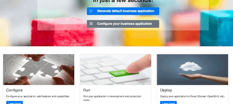

<p align="center"></p>

&nbsp;&nbsp;&nbsp;&nbsp;&nbsp;&nbsp;&nbsp;&nbsp;&nbsp;&nbsp;&nbsp;&nbsp;&nbsp;&nbsp;&nbsp;&nbsp;&nbsp;&nbsp;&nbsp;
[](https://github.com/kiegroup/jbpm/stargazers)
[](https://github.com/kiegroup/jbpm/network/members)
[]()
[](https://github.com/kiegroup/jbpm/pulls)
[](https://github.com/kiegroup/jbpm/graphs/contributors)
[](https://github.com/kiegroup/jbpm/blob/master/LICENSE-ASL-2.0.txt)
[](https://twitter.com/jbossjbpm?lang=en)

Quick Links
--------------------
**Homepage:** http://jbpm.org/

**Business Applications:** https://start.jbpm.org/

**Documentation:** https://docs.jboss.org/jbpm/release/latestFinal/jbpm-docs/html_single/

**JIRA:** https://issues.jboss.org/projects/JBPM/summary 

About jBPM
--------------------
**jBPM** is a toolkit for building business applications to help automate business processes and decisions.

**jBPM** can be used as standalone service or embedded in custom service. It does not mandate any of the frameworks to be used, it can be successfully used in
   - traditional JEE applications - war/ear deployments
   - SpringBoot or Thorntail (formerly known as WildFly Swarm) - uberjar deployments
   - standalone java programs
   
   
<p align="center"></p>
   
**jBPM** is open source software, released under the Apache Software License. It is written in 100% pure Java™, runs on any JVM and is available in the Maven Central repository too.

Building from source
--------------------

1. Check out the source:
```
git clone git@github.com:kiegroup/jbpm.git
```

If you don't have a GitHub account use this command instead:
```
git clone https://github.com/kiegroup/jbpm.git jbpm
```

2. Build with Maven:
```
cd jbpm
mvn clean install -DskipTests
```
Contributing to jBPM
--------------------
All contributions are welcome! Before you start please read the [Developing Drools and jBPM](https://github.com/kiegroup/droolsjbpm-build-bootstrap/blob/master/README.md) guide.

Getting Help
--------------------

Follow [this link](http://jbpm.org/community/getHelp.html) to with information on how to:
- **post questions** on user groups
- **report** and **create** issues
- **chat** with jBPM devs and community
- get **customer support**

Guides
--------------------
There is alot of good information (and books) available on jBPM and it's hard to list them all. Here are some of 
the most notable ones for quick reference:

- [Getting Started guide](http://jbpm.org/learn/gettingStarted.html) - great resource of getting started guides and videos
- [Accelerate your business](http://mswiderski.blogspot.com/) blog - includes a ton of great info from the jBPM devs
- [Slideshare Presentations](https://www.slideshare.net/krisverlaenen/presentations) - includes many jBPM presentations and slides
- [start.jBPM.org](https://start.jbpm.org/) - site where you can start building your jBPM Business Applications
